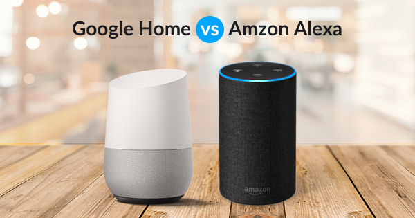
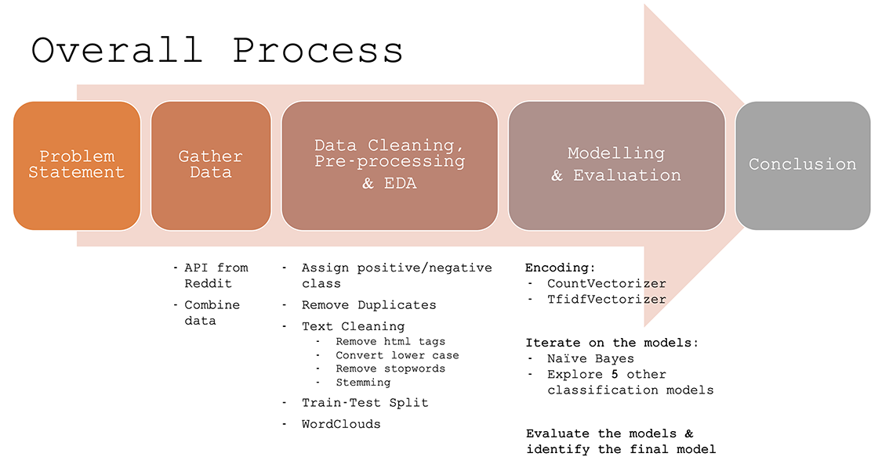
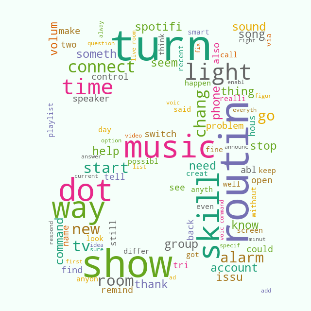

# Project 3: Web APIs & Classification (Part 1)

# Problem Statement

**[Amazon Echo](https://en.wikipedia.org/wiki/Amazon_Echo)** (aka **Alexa**) is a virtual home assistant device by Amazon, launched in November 2014 and dominates the US market with 61% share. [[source]](https://voicebot.ai/2019/03/07/u-s-smart-speaker-ownership-rises-40-in-2018-to-66-4-million-and-amazon-echo-maintains-market-share-lead-says-new-report-from-voicebot/)  However, the main competitor **Google Home** (rebranded to [Google Nest](https://en.wikipedia.org/wiki/Google_Nest_(smart_speakers)) is expanding rapidly in Asia given the stronger presence of Google.  

In order to expand Alexa in Asia market, the marketing analytics team at Amazon would like to understand what users of each brand are talking about and distill insights which could help drive marketing campaigns in Asia.

Reddit is the perfect source of data for this case because:
- **Direct user feedback:** Reddit is an American social news aggregation, web content rating, and discussion website where the discussion forums (aka 'Subreddits') is a *community* that is formed around user-created areas of interest. The website is known for its open nature and diverse user community that generate its content.
- **Strong presence in the US/UK/Germany/Canada:** As we're looking for feedback in markets where both devices have high presence, Reddit's user base fits this profile.  [[source-Reddit]](https://www.statista.com/statistics/325144/reddit-global-active-user-distribution/) [[source-Devices]](https://voicebot.ai/2019/04/15/smart-speaker-installed-base-to-surpass-200-million-in-2019-grow-to-500-million-in-2023-canalys/)

The 2 relevant Subreddits for this project are:
- **r/alexa**  (40.5k Members / 201 Online / latest post: less than 1 day)
- **r/googlehome** (202k Members / 710 Online / latest post: less than 1 day)

In the process of gathering data from Reddit API, the team lost lost the labels of the subreddit texts.  

### So the scope of the project is 2 folds:

### Problem 1: Classifying the texts with missing label

Develop a classification model to correctly identify the unclassified texts.  The marketing analytics team at Amazon would like to understand what users of each brand are talking about.  Our focus would be to have more complete classification for Alexa to get deeper insights to develop marketing plan, while for Google Home the team only needs enough data for comparative analysis.

### Problem 2: Insights for Marketing Analytics

Identify key insights that are generated from user discussion and identify next steps.

---

## Data Science Process:

To address our problem statement, the following approach was taken:

---

## Conclusion

### Problem 1: Classifying the texts with missing label

**Random Forest** is the model that gives the best sensitivity score.  Of all the `alexa` selftexts, >80% will be correctly classify as from `r/alexa` subreddit.

#### Future Next Steps:

- **Data to improve the model:** more texts from `alexa` is needed to improve the model as we are more interested in getting correct predictions for `alexa` while currently we have slightly less data vs. `googlehome` (48.5% vs. 51.5%).

### Problem 2: Insights for Marketing Analytics

**Based on most frequently words (wordcloud):**

   - Popular product that is most talked about is small formats (Echo Dot & Google Mini), can be the focused product to recruit new users as we are expanding to Asia.
   - **Sentiment Analysis** Based on the words frequently talked about, team and futher analyze associated sentiments to identify action plans.
     - Positive Sentiments:  can be the focus for advertising.
     - Negative Sentiments:  painpoints of consumers which can be feedback for internal development team.
   - **Topic Modelling** Based on frequently occuring words that are related to a feature on Alexa, then the team can further use to analyse users discussions based on different features.  Examples of features are:
     - Routine (a series of actions with a single command, or set to different times of day)
     - Skills (i.e. sleep sounds, song quiz, disney stories, etc)
     - Music
     - Time
     - Lighting (turn on/off, hue, etc)
   - Team can futher expand beyond Reddit to gain insights from multiple consumer forums.  Although Reddit is a great starting point for this project, it has limitations based on specific user profiles (gearing towards US, male, younger population) and may not fully represent other user profiles.  

