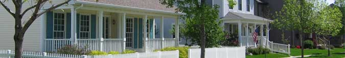
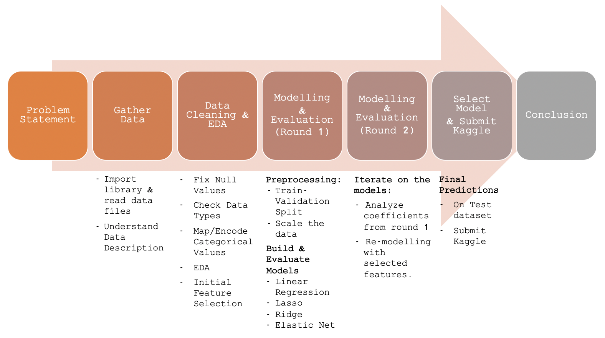
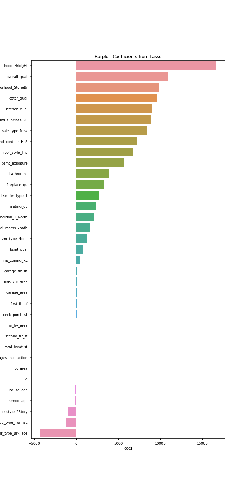
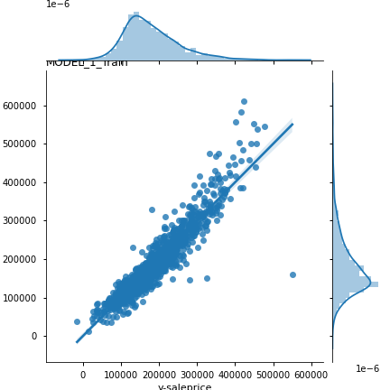
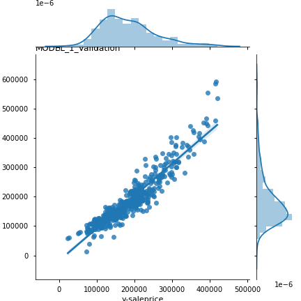
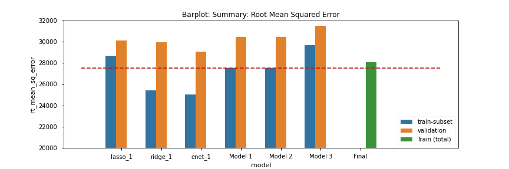
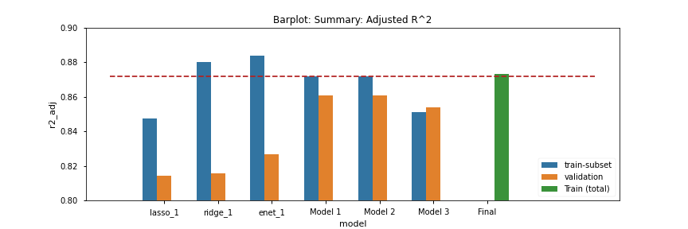
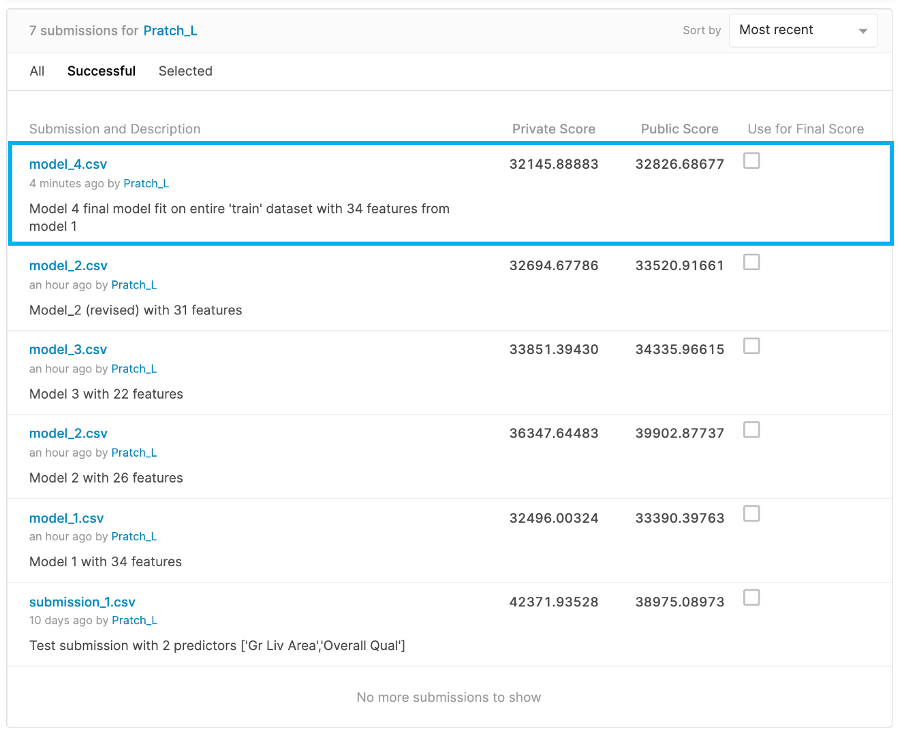

# Project 2 - Ames Housing Data and Kaggle Challenge

## Problem Statement

The objective of this project is to create a regression model that will predict the price of a house at sale in the city of Ames, Iowa.  This model will be used by real estate marketplace apps (like Property Guru) to help home sellers, buyers, or agents to estimate the sale price of a house by inputing their selection of relevant multiple features (i.e. Neighborhood, no. of rooms, etc).

## Executive Summary

**Objective:** To create a model to predict the price of a house at sale based on the Ames Housing Dataset.

**Process:**

To address our problem statement, the following approach was taken:

**Outcome:**

The final model that predicts the price of a house at sale is Model 4 with 34 features.  
Detailed can be find in [Part 2: Modelling and Evaluations](part_2-modelling-and-evaluation.ipynb)

---

## Conclusions:

Based on the problem statement, we have identified the regression model that can predict `'saleprice'` of a house in Ames Iowa.  The model is based on 34 the following features.
For example:
 - Neighborhoods **Northridge Heights** and **Stone Brook** have high value to sale price.
 - Quality of the house (Overall, Exterior, Kitchen) drives sale.

**MODEL 1** is the selected model.

**Key Steps involved to identify the model:**
- Data Cleaning and EDA (including mapping/encoding of categorical values)
- Train-Validation Split and Cross Validation (5-folds) was used to ensure the model performs well on unseen data.
- Data was scaled to elminate effect of different scales in numerical values (i.e. sqft vs. rooms)
- Lasso regularization helped reduce the variance in the model, as well as feature selection.

**Results**

- Performs well on both train & validation data
  - **Model 1 Training Date**  
  - **Model 1 Validation Data** 

- Low Error (Root Mean-Squared Error)
  - **Model 1** has the best bias-variance trade-off.  Although Rigde & ElasticNet has lower error in training, but higher in validation
  

- High Accuracy (Adjusted R-square)
  - **Model 1** has the best bias-variance trade-off.  Although Rigde & ElasticNet has higher R2 in training, but lower in validation
  

**Next Steps:** Based on the remaining 34 features, we can draw some inferences to this model (i.e. Neighborhoods), however this may not be helpful for home improvement projects.  For example, if a homeowner or architect would like to understand what kind of renovations (i.e. material selection) would help drive the sale price of a house, further analysis is needed.

## Kaggle Submission:

