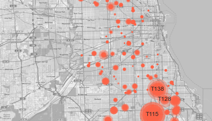
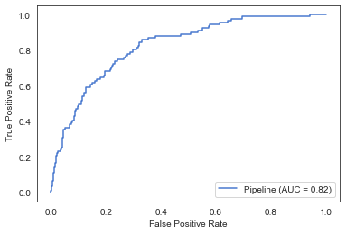
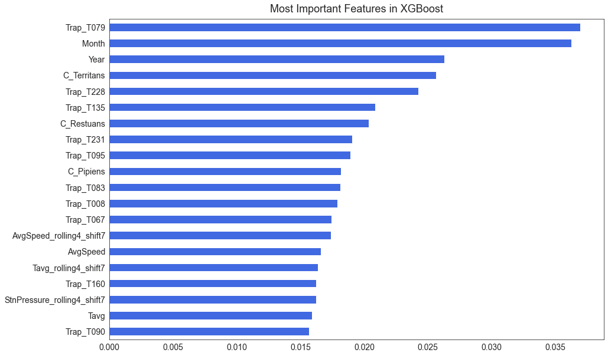

# DSI Project 4: West Nile Virus Prediction

*by Esther, Pratch, Wayne (DSI-16)*

---

## Background

[**West Nile virus**](https://www.cdc.gov/westnile/) (WNV) is most commonly spread to humans through infected mosquitos. Around 20% of people who become infected with the virus develop symptoms ranging from a persistent fever, to serious neurological illnesses that can result in death.

In 2002, the first human cases of West Nile virus were reported in Chicago. By 2004 the City of Chicago and the Chicago Department of Public Health (CDPH) had established a comprehensive surveillance and control program that is still in effect today.

Every week from late spring through the fall, mosquitos in traps across the city are tested for the virus. The results of these tests influence when and where the city will spray airborne pesticides to control adult mosquito populations.

This project is from [kaggle](https://www.kaggle.com/c/predict-west-nile-virus/overview).

---
## Problem Statement

Due to a recent outbreak of the West Nile Virus in the city of Chicago, our Data Science team at the Disease and Treatment Agency has been tasked by the Centers for Disease Control (CDC) to develop a strategy to deploy the effective use of pesticides, by targeting spraying of pesticides to areas of high risk will help to mitigate future outbreaks.

Leveraging on weather, location, mosquito population and spraying data, the team will develop a **binary classification model to predict the presence of the West Nile Virus** in the city of Chicago.

The model that achieves the **highest ROC AUC score** and **Sensitivity** on the validation data set, will be selected as our production model.

High ROC AUC score means that our model has strong discrimination capacity to distinguish between positive class and negative class. Our **baseline ROC AUC score will be 0.5**, which means that the model has no discrimination capacity to distinguish between the 2 classes.

To mitigate the risk of future outbreaks, we want to be as accurate as possible at predicting the presence of West Nile Virus (positive class).  Hence, we will focus more on the **Sensitivity Score** (True Positives / (True Positive + False Negative)).  There is a higher risk of outbreaks if the model predicts an absence where the virus is present (False Negative), whereas it is just overcaution if the model wrongly predicts a presence of the virus (False Positive).

---
## Executive Summary

Model 5 based on XGBoost Classifier is the best model to address our problem statement as it has the highest scores on both ROC AUC (0.83) and Sensitivity (0.85), generating the predictions that maximizes True Positive and minimizes False Negative (incorrectly predicting absence of virus).

Based on this model, the most important factors for predicting presence of West Nile Virus are as follows:
1. **Seasonality** (Month and Year)
2. **Weather** (Pressure and Precipitation - with feature engineering to capture mosquito breeding period by rolling average of 7-10 days)
3. **Mosquito Species** (C_Restuans and C_Territans)
4. **Hotspots** (Traps: T900, T002, and T115)

These factors will be used to identify strategies to prevent West Nile Virus (i.e. spraying the hotspots duing the peak month).

---
## Project Approach

## 1. Data

Our Data Science Team is given the following set of data:

**1.1 Train & Test Dataset**

This is a set of test results of mosquito traps with the following features:

|Feature|Description|
|:---|:---|
|Id| Record Id|
|Date| Date |
|Address| Full address of trap location |
|Species| Species of mosquitos found in trap|
|Block| Block number in address|
|Street| Street name in address |
|Trap| Trap ID |
|AddressNumberAndStreet| Block number and street of trap location |
|Latitude | Latitude based on Address of trap location |
|Longitude| Latitude based on Address of trap location |
|AddressAccuracy| Address accuracy (Values: 1 to 9)|
|NumMosquitos| Number of mosquitoes caught in this trap|
|WnvPresent| PResence of West Nile Virus in mosquitos in the trap (Values: 1: WNV is present, 0: WNV not present)|

These test results of the mosquito traps are organized in such a way that when the number of mosquitos exceed 50, they are split into another record (another row in the dataset), such that the number of mosquitos are capped at 50.

**1.2 Spray Dataset**

Geographic Information Systems (GIS) data for City of Chicago's spray efforts to kill mosquitos in 2011 and 2013. It contains data on the Date, Time, Longitude and Latitude of spray.

**1.3 Weather Dataset**

This dataset is from [National Oceanic & Atmospheric Adminstration](https://www.noaa.gov/), containing the weather conditions of 2007 to 2014, during the months of the tests.

* Station 1: CHICAGO O'HARE INTERNATIONAL AIRPORT Lat: 41.995 Lon: -87.933 Elev: 662 ft. above sea level
* Station 2: CHICAGO MIDWAY INTL ARPT Lat: 41.786 Lon: -87.752 Elev: 612 ft. above sea level

The data dictionary document for the weather dataset is available in our github repository.

## 2. Data Cleaning & EDA

Based on the initial data exploration, the datasets contain the following:

|Datasets|Years|No. of Columns|No. of Rows|Null Values|Duplicated Rows|
|:---|:---|:---|:---|:---|:---|
|Train|2007, 2009, 2011, 2013|12|10,506|0|813|
|Test |2008, 2010, 2012, 2014|11|116,293|0|0|
|Weather|2007-2014|22|2944|10,359|0|
|Spray|2011, 2013|4|14,835|584|541|

As part of **Data Cleaning**, the following were performed:
1. Review the missing values for the weather data by station, as the data is collected by Station 1 and Station 2, and impute with appropriate values based on the weather calculations (e.g. Tavg, Wetbulb), reference to the other station (e.g. Sunrise, Sunset), or drop the column with all null values (e.g. Water1)
2. Duplicated rows for train arises from the where the number of mosquitos in the same trap in the same location on the same day is greater than the cap of 50, causing the split into multiple records.  We group these records by date, trap, location, and species.

The **Exploratory Data Analysis** are conducted as follows:
1. Visualize the distributions of each dataset by year.
2. Analysis and visualizations of the **Target Variable** (Presence of West Nile Virus `'WnvPresent'`) revealed a highly imbalanced data with 94.6% not present (class 0) and 5.4% present (class 1), with high fluctuations by year.  We also explored seasonality in number of mosquitos and presence of Wnv, as well as the location of "hotspot" traps.

3. Exploratoty of the weather data with distributions of continuous variables, and checking multi-colinearity of related features to select the strongest for modelling.

## 3. Feature Engineering

1. Engineer temperature features for mosquito breeding period window of 7-10 days and optimal temperature range.
3. Encode categorical variables (Species and Trap)

## 4. Modelling & Model Evaluation

The following models were explored with different strategies to handle imbalanced data.
1. Logistic Regression (with SMOTE)
2. Random Forest (with Class Weight)
3. AdaBoost (with SMOTE) a.k.a SMOTEBoost
4. Gradient Boost (with SMOTE)
5. XGBoost (with scale_pos_weight)

Models were evaluated based on ROC AUC, while we also look at Sensitivity as the nature of predicting virus (maximizing true positive and minimizing false negative).

Comparing the 5 models, XGBoost performs the best in terms of both ROC AUC and Sensitivity.

Predictions on the test data resulted in ROC AUC of 0.77363 (Kaggle public score)

## 5. Conclusion & Recommendations

Model 5 based on XGBoost Classifier is the best model to address our problem statement as it has the highest scores on both ROC AUC (0.83) and Sensitivity (0.85), generating the predictions that maximizes True Positive and minimizes False Negative (incorrectly predicting absence of virus).

Based on this model, the most important factors for predicting presence of West Nile Virus are as follows:
1. **Seasonality** (Month and Year)
2. **Time** (Pressure and Precipitation - with feature engineering to capture mosquito breeding period by rolling average of 7-10 days)
3. **Mosquito Species** (C_Restuans and C_Territans)
4. **Hotspots** (Traps: T900, T002, and T115)

Our model has ROC AUC (kaggle score) of 0.77 on completely unseen data.

In our cost benefit analysis, the most cost effective scenario is **Targeted Spraying** the top 5 mosquito hotzones for 6 times during peak period (Jul-Aug).

